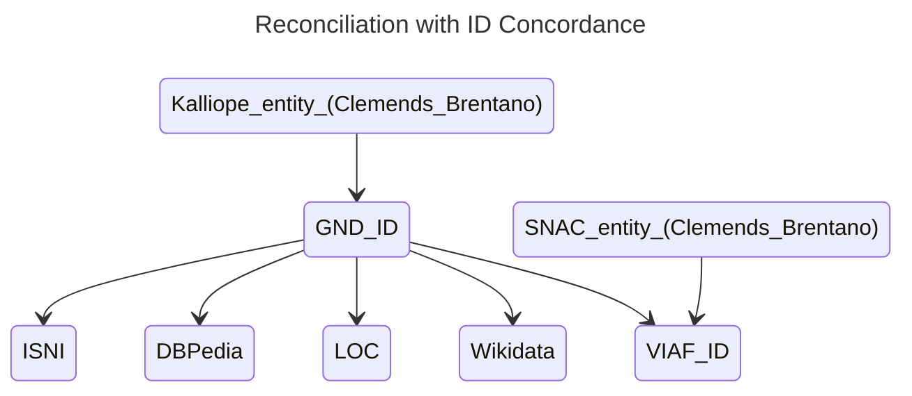
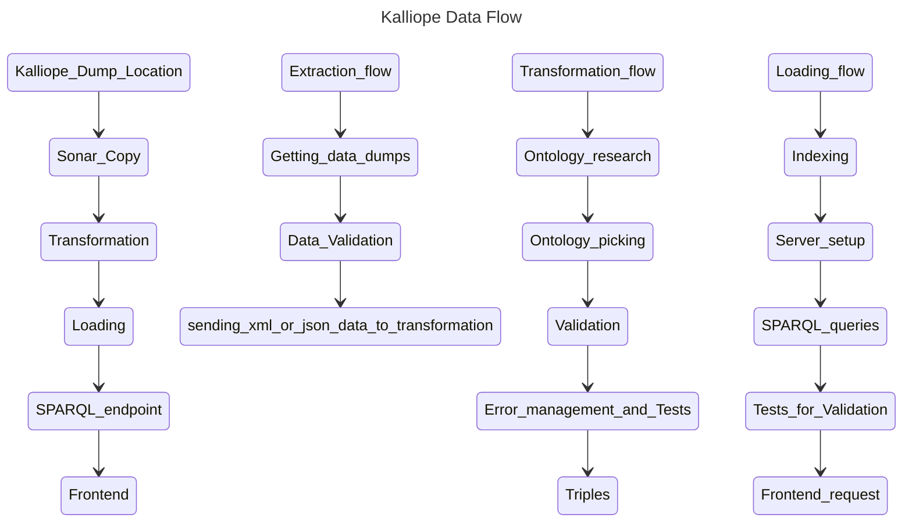

# SoNAR Architecture

*Updated: 12.06.2026*

SoNAR harvests metadata from several databases like Kalliope, DNB, GND, SNAC etc., fuses and enriches the data using semantic inferencing, ID Concordance relationships and using external datasources like Wikidata. 

*The emphasis of this project is to provide easily accesible data to researchers in Digital Humanties for Historical Netwoks Anaylsis.*


Data fusion occurs via DSL Transformation rules, where different databases are transformed or linked so that the agent data is enriched.

Semantic inferencing occurs at the DB level where the implicit relationships are established using ID concordance.

# MVP Scope
- Databases: Stabikat, Kalliope
- Networks: Correspondence, Co-author relationships
- Translation: Wikidata

## Functional Requirements
*Based on the MVP Narrative, a music research student want to get network correspondence data as easy as possible. Databases involved: Kalliope, GND, SNAC. But this is only one narrative from many.*

Main functional requirement is an **ETL pipeline** for all the DBs.

## Extraction
- Kalliope
    - Dump is available and SRU for updates in MODS3.7
        
        *Using SRU for updates is not reliable, tip from experts. So decided to work with data dump.*

- GND, ZDB, DNB
   - Triplestore dumps are available, OAI in Beta.

- Museum Digital
    - Intial Retrieval via Rest API.
    - OAI Updates: tried and causing issues to retrieve data.
- SNAC
    - Initial Retrieval via Rest API
    - Updates through API
- GBV 
   - Not checked yet
- Enrichment using wikidata.

## Transformation
Ontologies are required to structure the data coming from different sources under the same class as long as the properties match. Some of the databases in SoNAR don´t have exisiting Ontologies to transform the data. Although their source data formats like XML, JSON etc have a data model, but it is different for different datasets, which proves the point that we need a common terminology to match similar data.

The transformation here acts a bridge between different datasets. This transformation can be achieved by using Domain Specific Language(DSL) in tools like **Catmandu** or **Metafacture**. The merging of different data  aka **Reconciliation** is achieved by **ID Concordance** i.e., linking IDs from different authority files to the same person or an entity aka **Data Enrichment**.
### Process 1
```
# Example of ID Concordance that merges data from different DBs

# Kalliope
In Kalliope, Clemens Brentano is represented by a GND ID
## RDF Triple
<https://kalliope-verbund.info/DE-611-BF-39849> owl:sameAs <https://d-nb.info/gnd/118515055> .

# SNAC
In SNAC, Clemens Brentano is represented by a VIAF ID
## RDF Triple
<snac_record_identifier> owl:sameAs <https://viaf.org/en/viaf/73863902> .

# Merging
Using VIAF API to get GND ID from DNB
<https://d-nb.info/gnd/118515055> owl:sameAs <https://viaf.org/en/viaf/73863902> .
```

Because every record in SNAC has a VIAF ID (needs to be verified), using the [VIAF API](developer.api.oclc.org/viaf-api), DNB and SNAC data can be merged.

All the merged triples from ID Concordance form a new graph called as **Identity Resolution Graph**.

### Process 2 - Standing on the shoulders of the giant DNB
*Note: DNB SPARQL Service has already linked GND with VIAF* 

**Instead of querying VIAF API, if the DNB GND and SNAC data are already in the Triplestore and are indexed. They are automatically linked beacuse of above note and can be queried from SoNAR SPARQL endpoint.**


```
# DNB SPARQL Query to get all external URIs belonging to an entity
PREFIX owl: <http://w3.org>

PREFIX owl: <http://www.w3.org/2002/07/owl#>
SELECT ?externalURI
WHERE {
  <https://d-nb.info/gnd/118548018> owl:sameAs ?externalURI .
}
LIMIT 10

```

``` 
DNB data is generally linked with: loc, viaf, wikidata, dbpedia, isni etc.
```

Tools: Metafacture and Catmandu
### Metafacture
*Native Java, recommended for Nifi*
- Flux: Flow orchestrator, similiar to piping in Linux

- Fix: transformer, that changes the data format


Check out the simple examples [here](./experiments/transformation/).
### Catmandu
*Perl, ExecuteStreamCommand* 
- Fix: as a metadata transformer

*Note: Both support output as triples. But Metafacture documentation is not so easy to understand and is not comprehensive. There are many hidden things from the documentation, whcih makes the learning curve steep and developer experience hard.*

## Loading
After the tranformation, the data is in RDF Triple format, and can be indexed either by using CRON or event based schedule.
- [Semantic Inferencing](https://graphdb.ontotext.com/documentation/11.3/introduction-to-semantic-web.html#reasoning-strategies) in Graph DB can help in creating new relationships between the entities in the graph network, whereas in Qlever it is static and we need to create this linking in the transformation phase and re-index it.
- Qlever is mainly static and GraphDB is dynamic but slow.

**Tools: GraphDB, qlever etc.**
## Data Pipelines
As each database is different in its input format like XML, JSON etc. and the definition of datamodel, it is necessary to create a pipline for each. This section provides a suggestion on how it might look but it needs to developed iteratively with more deeper look on each dataset.


Ontologies: AgRelOn, RICO? (needs to be checked)

# Non-functional requirements
## Performance 
## Scalability 
## Security

 


