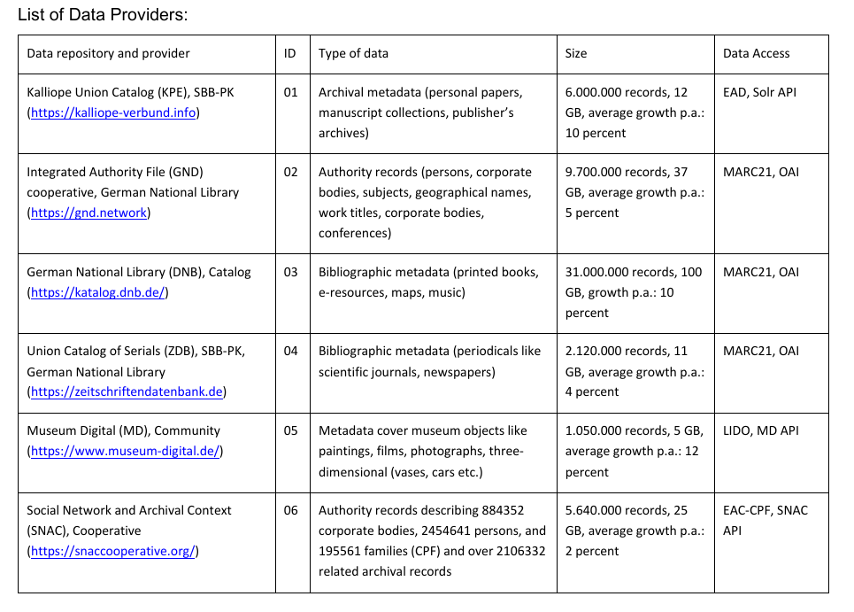

# Data Overview
SoNAR harvests metadata from different databases to provide an easy way to search and download relavant data for the Historical Network Researchers.

## Kalliope

Data Access: https://kalliope-verbund.info/de/support/sru.html

Dump Available: ?

## DNB, ZDB, GND
All these data dumps are maintained by DNB. *Available here: https://data.dnb.de/opendata/*

- DNB catalog titles data
- ZDB catalog titles data
- GND data: persons,institutions,congress etc.
- Entity data service is a RESTAPI returning JSONs of GND Entities: https://www.dnb.de/EN/Professionell/Metadatendienste/Datenbezug/Entity-Facts/entityFacts_node.html
- Metadata Services: https://www.dnb.de/EN/Professionell/Metadatendienste/metadatendienste_node.html

## Museum Digital
API Documentation: https://nat.museum-digital.de/swagger/

OAI: https://nat.museum-digital.de/oai

## SNAC
Data access: https://snaccooperative.org/api_help

This is currently being blockeddue to bot checks. 
*Returns the full Constellation in the requested format. To perform a direct download, without JSON wrapping, submit a request to the webUI interface, https://snaccooperative.org/download/{constellationid}?type={type} or https://snaccooperative.org/download?arkid={ark}&type={type}.*

Example: https://snaccooperative.org/download/8148708?type=eac-cpf