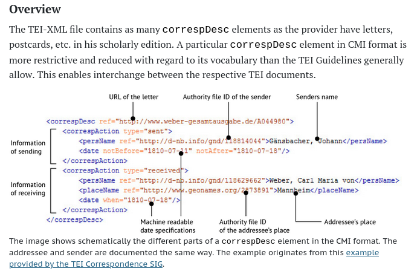

# Digis Data Workshop - 18.06.2026
*Updated: 23.06.2026*

*[Workshop Presentation](https://zenodo.org/records/20598931)*

## Intro
### Which objects does Metadata define?
The session started with describing the **Metadata of Objects**. The objects can be physical like a sculpture, machine, a book etc., or a digital object like photo, audio, video. 

### What is Paradata?
**Paradata** is important to track the modifications done on an object. This data is mainly used to reproduce or track the exact processes that an object has gone through.
- It can define the how a book has been restored.
- It can define the parameters of an camera when the photograph has been taken. 
Paradata: example: process details if something has been done on the object

### FAIR Principles
**Findable, Accesible, Interopable, Reusable**

- **Findable** - Easy to find for both humans and machines. Linked Data concept of semantic web.
- **Accessible** - How to get access to the data? Protocols like SRU, data dumps etc.
- **Interopable** - Data can be changed from one format to another. Example: DC to MODS and viceversa.
- **Reusable** - Data should be easy to enrich and should be richly described.

As long as one sticks to the common standards at each stage of the ETL pipeline, then one can say the data follows FAIR principles.
## Important for SoNAR
- [CorrespSearch](https://correspsearch.net/en/datasets.html) already did research in HNR. They focussed on around 400k letters from the year 1400 till 2000 using CMIF data format.

 

- More info on datapipeline: https://correspsearch.net/en/about.html
    
    - [CMIF data format](https://github.com/TEI-Correspondence-SIG/CMIF/tree/main): XML based but only uses vital information needed for the letters like sender, receiver, GND ID. 
    - **Xtriples** has been used to convert CMIF to RDF.
    - Uses **Beacon** to integrate authorities.
    - Uses **GEONAMES** to integrate geographical data.
    - Provides data in CMIF, CSV, JSON, RDF format.
- Opportunity to present SoNAR at [WikiKult](https://meta.wikimedia.org/wiki/WikiKult_-_Offene_Kulturdaten).

## Data Standards

| Section | Field / Element | Data Standard | Example Identifier / Value |
|---|---|---|---|
| Metadata | Sender | GND / VIAF | GND:118540238 (Goethe) |
| | Sender Location | GeoNames | GeoNames:2812482 (Weimar) |
| | Date | ISO 8601 / EDTF | 1784-05-15 |
| | Addressee | GND / VIAF | GND:118617222 (Stein) |
| | Place of Address | GeoNames | GeoNames:2888636 (Kochberg) |
| Provenance | Current Repository | GND (Corporate) | GND:2020501-7 (SBB-PK) |
| | Shelfmark | TEI <idno> | Ms. Germ. quart. 123 |
| | Ownership History | CIDOC-CRM | E8_Acquisition (Donation, 1922) |
| Print Info | Editor / Work | ISBN / DOI | ISBN:9783406605550 / DOI:... |
| | Pages / Location | Library Std. | Vol. 3, pp. 45–52 |
| Registers | Mentioned People | GND / VIAF | GND:118607626 (Schiller) |
| | Mentioned Works | GND (Work) | GND:4128140-5 (Faust) |
| | Mentioned Places | GeoNames | GeoNames:2895043 (Jena) |
| | Mentioned Bodies | GND (Corporate) | GND:36164-1 (Uni Jena) |
| | Periodicals | ZDB-ID | ZDB:513220-7 (Thalia) |

------------------------------

## Recommendations for Museums
- Use standards like CIDOC and LIDO 
- Use GNDs
- Minimum data like object title, person, link to data, rights, id, lang, etc
- Main focus on what minimum data is required to digitalise an object in museum or an Archive.

## Participated Instiutions
- https://syrian-heritage.org/
- http://www.bbaw.de/
- https://bibliothek.potsdam.de/de

## References: 
- [FAIR Principles](https://www.go-fair.org/wp-content/uploads/2022/01/FAIRPrinciples_overview.pdf)
- [CorrespSearch Research Paper](https://journals.openedition.org/jtei/1742)
- [X Triples Presentation](https://metacontext.github.io/presentation-correspsearch-xtriples/#/step-1)