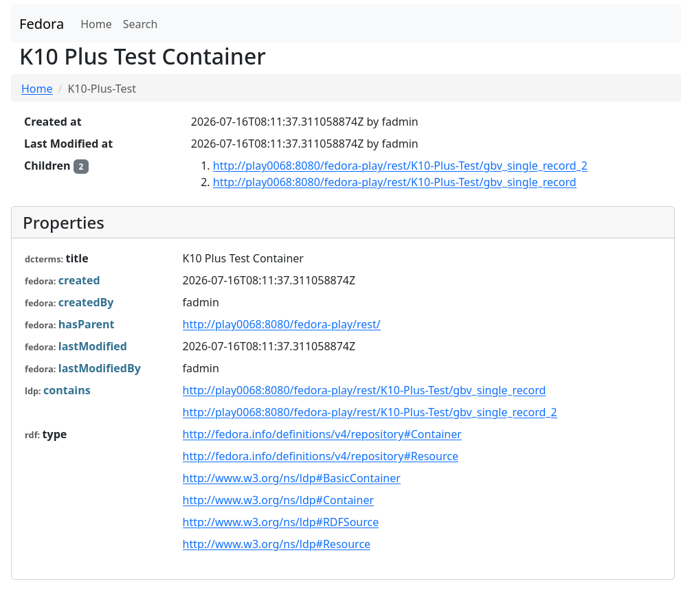

*Flexible Extensible Digital Object Repository Architecture*
### Intro
Fedora is a middleware used for digital preservation. It provides REST API for data management. Uses OCFL format to preserve objects. 

*Fedora with OCFL supports versioning, automated fixity provisioning and verification, and a variety of storage technologies, including S3.  Fedora also provides an optional audit service, to track changes to resources over time and document provenance.*

- **Automated fixity provisioning and verification** - calculates a checksum for every object when it is created and verifies it regularly to check for data corruption.
- **S3** - Storage where the data resides.
- **Audit Service** - tracks who did what and when.
- **Versioning** is done automatically.

### Resource Types
 Resources are stored in binary format and can take the following forms:
- Binary: single resource
- Container: Collection of several independent binary resources. (collection of books)
- Archival Group: Collection of resources and acts a single resource. (a single book, where each page is a resource)

*Note: A single change in Archival Group, generates a new version for the group. In container, individual book can have a new version.*

### Data Size
- Smaller data can be stored in Fedora server directly
- Big Data should not be ingested using Fedora rather provide a S3 link (pointer) to where the data is residing. As handling big data can choke Fedora API. aka [Side Loading](https://wiki.lyrasis.org/spaces/FEDORA6x/pages/199525662/RESTful+HTTP+API+-+Side+Loading)
- In cases, where big data is pre-zipped to chunks, it is recommended to store in a container, as it looks logically clean.
### Metadata
The metadata is always in RDF format. Example shows a container with 2 children, where each child is data sample from K10 Plus.


Each child has its own metadata as well.

### Creating a container

```
# Add a new rdf resource with a title
sparql='<> <http://purl.org/dc/terms/title> "My container title" .'
curl -i -X POST -H "Content-Type: text/turtle" -H "Slug: new-container" --data-binary "$sparql" "$fedora_test_base" -u "$fedora_test_cred_rw" 
```
*Slug* : defines the path to the new container. *$fedora_test_base/new-container*
After running this command, fedora creates a container with some default metadata and given data.

#### Putting Objects inside a container
```
curl -X PUT "${fedora_test_base}new-container/test-data" -u "$fedora_test_cred_rw" \  
 -H "Link: <http://www.w3.org/ns/ldp#NonRDFSource>; rel=\"type\"" \  
 -H "Content-Type: application/zip" \  
 -H "Content-Disposition: attachment; filename=\"gbv_test.zip\"" \  
 --data-binary @"gbv_single_record.zip"
```
- *new container* - is the container path where the objects reside.
- *test-data*: is the link or path where the uploaded file will be stored.
- *link* - tells fedora that it is a nonRDF resource like jpg, zip, xml etc
- *content-type* declare MIME type
- *content-disposition* declare new file name if needed
- *--data-binary*:  path to data file on local machine
### Creating Objects

```
curl -X PUT "${fedora_test_base}test-data" -u "$fedora_test_cred_rw" \
  -H "Link: <http://www.w3.org/ns/ldp#NonRDFSource>; rel=\"type\"" \
  -H "Content-Type: application/zip" \
  -H "Content-Disposition: attachment; filename=\"gbv_test.zip\"" \
  --data-binary @"gbv_single_record.zip"

```
#### To write more metadata to an object
```
curl -i -X PUT -u "$cred_read_write" \
  -H "Content-Type: text/turtle" \
  --data-binary "@metadata.ttl" \
  "$base"test-data/fcr:metadata
```
*@: reads the path from the current dir*
This request explained:
- giving the user credentials for auth
- stating that the data is an object not a container and is a non-RDF object
- location and type of data that is being ingested and metadata file location and type related to the data object, 
- where does the data go relaitve to $base

### Metadata Example file:
```
PREFIX prov:     <https://www.w3.org/ns/prov#>
PREFIX dc:       <http://purl.org/dc/elements/1.1#>
PREFIX dcterms:  <http://purl.org/dc/terms#>
PREFIX xsd:      <http://w3.org>
PREFIX sonar:    <http://sonar-project.sbb.berlin#>

# Use the exact Fedora target URI for the subject
<http://play0068:8080/fedora-play/rest/test_k10plus>
    a prov:Entity ;
    dc:title "K10 Plus Database Test" ;
    dcterms:description "tar.gz package contains a sample data dump." ;
    prov:wasGeneratedBy sonar:curl_upload_script .

# The Software Tool
sonar:curl_upload_script
    a prov:Agent, prov:SoftwareAgent ;
    dc:title "cURL Command Line Tool" ;
    dcterms:description "cURL command executed in the terminal to upload the file." ;
    # The tool was acting under the control of the person
    prov:actedOnBehalfOf sonar:komal .

# The Person
sonar:komal
    a prov:Agent, prov:Person ;
    dc:title "Komal" ;
    dcterms:description "Developer who manually executed the terminal command." .


```
### Reading Objects
```
curl -i -X GET -u "$cred_read_write" "$base"test-data
```
### Reading Metadata
```
curl -i -X GET -u "$cred_read_write" "$base"test-data/fc  
r:metadata
```

To read hash related data
```
curl -i -X GET -u "$cred_read_write" "$base"test-data/fc  
r:fixity
```

### Deleting Objects
```
# 1. Delete the resource
curl -X DELETE -u "$cred_read_write" "$base"test-data

# 2. Clear out the tombstone marker so you can reuse the path
curl -X DELETE -u "$cred_read_write" "$base"test-data/fcr:tombstone
```
*Tombstone: when you delete data that links to other data, fedora keeps it but makes it unavailable to preserve data integrity*


### Metadata Output
*Example: /metadata_output.ttl*

Fedora comes with its own Ontologies for objects as seen in this example output after object creation.
- PREMIS - models **Objects, Events, Agents and Rights**, is based on OWL, maintained by LoC.
- **EBUCore** (European Broadcasting Union Core): models specs of audio, video, and multimedia assets
-  LDP (Linked Data Protocol): from w3c