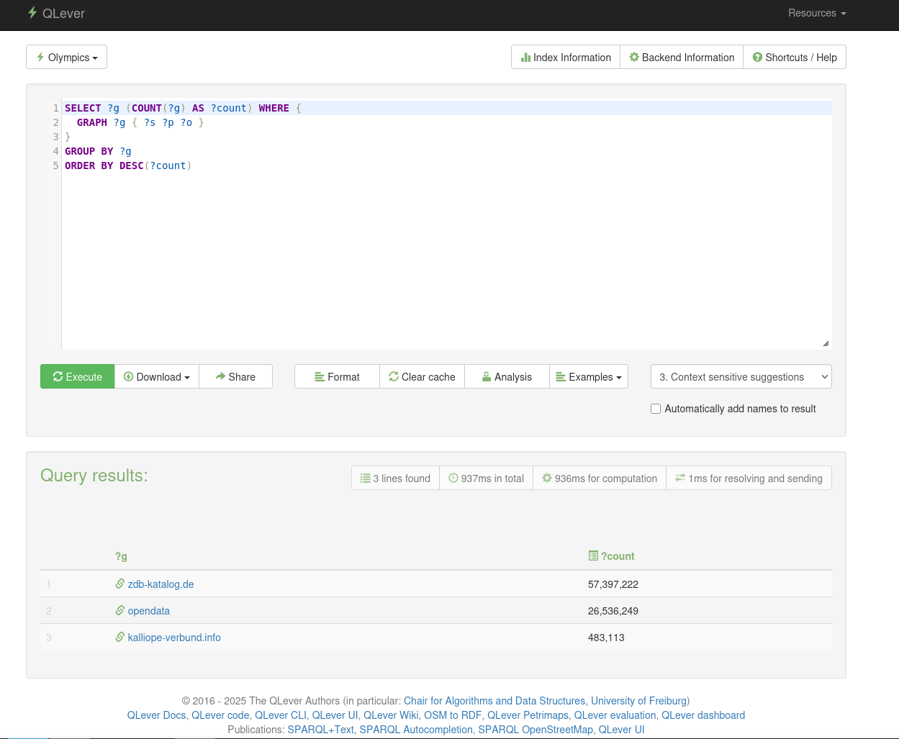
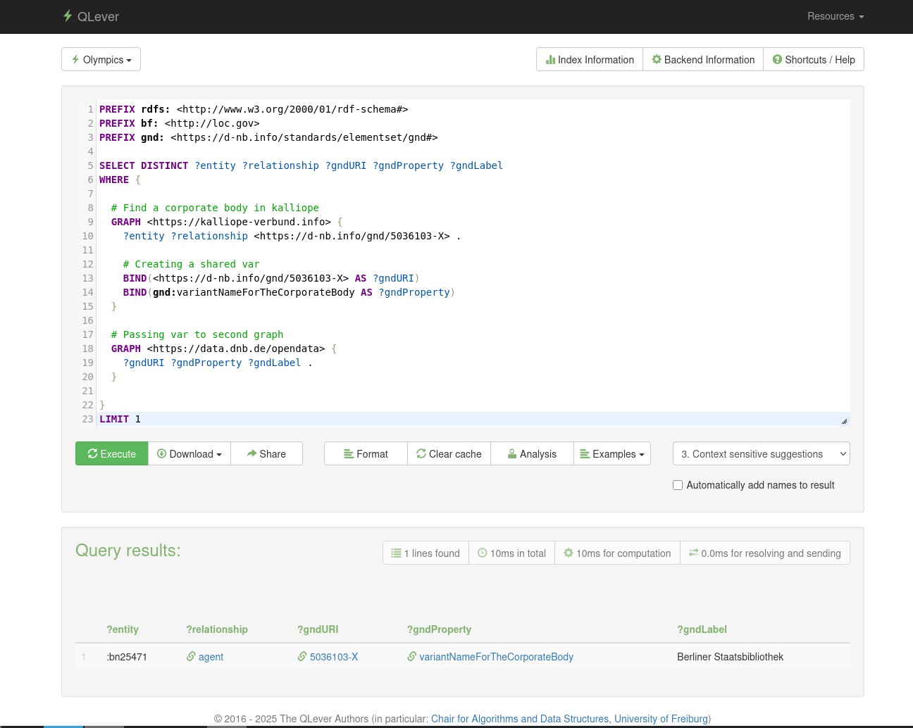

# Multi Graph Approach for SoNAR

## Introduction
SoNAR harvests metadata from different databases. To create easily accessible data for the Historical Network Researches, SoNAR should be able to combine data from different databases, so that the information is comprehensive.

Example:
A music researcher wants to know more about the war of the romantics and is particularly interested to do network research on all the people involved and number of the letters exchanged between them. 

The following questions will arise:
* Who are the people involved?
* Who are closely related to each other? 
* How many letters have been exchanged?
* What else do we know about each person?
* In which institution are they involved?

The letters exchanged metadata is present in the **Kalliope** and more information on the persons, institutions is available in **GND**. 

This creates the need to be able to identify the people or institutions in the Kalliope and get more details from GND. **qlever** provides **MULTI_INPUT_JSON** approach where any number of graphs can be combined using a **graph identifier**. This preserves the ontology of the graph and at the same time lets you query the data from different triplestores with a single **SPARQL** command.

For more details, check:

- Qleverfile - config file for qlever
- Qleverfile-ui.yml - config file for qlever UI, where examples are available.

## ETL Pipeline
For data extraction, **Apache Nifi** provides with many features like **Backpressure, Data Provenance etc.** As it is a flow programming software, it is indeed easy to understand the data pipeline.

The fundamental units of Nifi are **Processor** and **flowfile**. **Nifi** uses a **Processor** to do a specific action either to get,transform and save the data etc. **Flowfiles** carry-forward the data from one processor to another. 

For this experiment, the main objective is to get acquainted with the whole pipeline, the above example has been used to test the question: 

**"How easy is it to get the implement a data pipeline which provides some value to the Historical Network Researchers?"**


### Data Extraction and Transformation Flow
- Using **GenerateFlowFile**, a schedule based extraction of **Kalliope** data using SRU/CQL protocol has been configured.
- The letters data from **Kalliope** is fetched iteratively from the **Musik Abteilung** at 100 records in MODS3.7, per request using a control rate so that the data calls won't be blocked.
- **SplitXML** creates a flowfile for each record.
- Each flowfile now goes through the following stream of commands, to transform itself from MODS37 to RDF Tripelstore format.

    - XML Starlet processes the XML response and returns "mods" element in the record element tree.
    - This mods element now is converted to **BIBFRAME Ontology (Work, Instance, Item)** using **Saxonica XSLT** transformation.
    - Using **Rapper**, each record is now converted to **Tripelstore RDF format(.ttl, .nt, .json-ld)**
    - *Hint: Make sure that the paths in **ExecuteStreamCommand Processor** are rightly configured*
- Using **MergeContent** time or size based data dumps are created which are then compressed and written to memory.
- GND, ZDB, DNB catalog data are already available in Triplestore format with their own ontology. These data dumps are currently checked daily with CRON based **GenerateFlowFile** with the checksum and downloaded when it changes.


### Data Transformation
 The current data transformation is based on **BIBFRAME Ontology** for data where there is no Ontology. For Triplestore DBs like GND, ZDB, and DNB, the existing ontology has been used as it is.

### Data Indexing
Once the data is available in any of the Triplestore format, it is easy to index using qlever by modifying Qleverfile, as mentioned in the [`Introduction`](#introduction). 

## Results

The current experiments answers only a few questions from the initial hypothesis in the [`Introduction`](#introduction) namely:

- Getting more information on the persons and the institutions invovled.


#### SPARQL query in qlever showing Integrated Triplestores from Kalliope, GND, ZDB



#### Multi Graph Search
Using a GND ID from Kalliope and getting more info of the same GND ID in GND Tripelstore.


## Setup
This experiment needs **Nifi**, **xmlstarlet**, **Saxonica XSLT**, **rapper** and **Qlever**.

```bash
sudo apt update && sudo apt install -y openjdk-21-jdk
wget https://dlcdn.apache.org/nifi/2.9.0/nifi-2.9.0-bin.zip
wget https://downloads.apache.org/nifi/2.9.0/nifi-2.9.0-bin.zip.asc
wget https://downloads.apache.org/nifi/2.9.0/nifi-2.9.0-bin.zip.sha512
# verify keys
if echo "$(cat nifi-2.9.0-bin.zip.sha512) nifi-2.9.0-bin.zip" | sha512sum -c - &> /dev/null; then
    echo "Hash match verified! Unzipping file..."
    unzip nifi-2.9.0-bin.zip
else
    echo "ERROR: Hash mismatch!" >&2
    exit 1
fi

# chnage the conf/properties manually
# Network properties for NIFI
# hostname -I
#nifi.web.https.host=<ip address>
#nifi.web.https.port=<port>

# Access control properties
#nifi.web.proxy.host=<ip_address>:<port>

# Get the first IP address from hostname -I
SERVER_IP=$(hostname -I | awk '{print $1}')

# 2. Replace the lines dynamically in nifi.properties
sed -i "s|^.*nifi.web.https.host=.*|#nifi.web.https.host=${SERVER_IP}|" conf/nifi.properties
sed -i "s|^.*nifi.web.https.port=.*|#nifi.web.https.port=8443|" conf/nifi.properties
sed -i "s|^.*nifi.web.proxy.host=.*|#nifi.web.proxy.host=${SERVER_IP}:8443|" conf/nifi.properties

# 3. Verify the changes
grep -E "nifi.web.https.host|nifi.web.https.port|nifi.web.proxy.host" conf/nifi.properties

# Run Nifi
# ./nifi-2.9.0/bin/nifi.sh start

sudo apt-get install libsaxonhe-java
sudo apt-get install xmlstarlet
sudo apt-get install raptor2-utils
sudo apt update && sudo apt install -y wget gpg ca-certificates
wget -qO - https://packages.qlever.dev/pub.asc | gpg --dearmor | sudo tee /usr/share/keyrings/qlever.gpg > /dev/null
echo "deb [arch=amd64 signed-by=/usr/share/keyrings/qlever.gpg] https://packages.qlever.dev/ $(. /etc/os-release && echo "${UBUNTU_CODENAME:-$VERSION_CODENAME}") main" | sudo tee /etc/apt/sources.list.d/qlever.list
sudo apt update
sudo apt install qlever

```
```bash
# Run Nifi
./nifi-2.9.0/bin/nifi.sh start
```

```bash
# Run qlever (only for manual testing)
# qlever indexing and starting is controlled using Apache Nifi
qlever index
qlever start
```