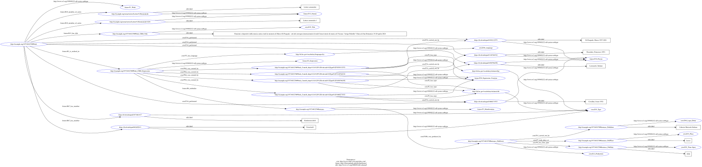

# MVP: K10Plus MARC --> SoNAR HNA Graph
*Updated: 06.07.2026*

## Data Transformation Pipeline

  ```mermaid
flowchart LR
    subgraph MARC2BIBFRAME[MARC2BIBFRAME Converter XSLT]
        direction LR
        m1[Preprocessing: format and split] --> m2[MARC to BIBFRAME]
    end
    subgraph RDF2CIDOC[BIBFRAME RDF to CIDOC Converter]
        direction LR
        f --> t2[/HNR Graph/]
    end
    subgraph BIBFRAME2[BIBFRAME Graph]
        direction LR
    m2 --> r[/RDF/]
    r -->|rapper| t[/.ttl/]

    end

    s1[/GBV MARC XML/] --> m1
    t --> f[Data Filter: SPARQL Construct]
  ```

## Tentative BIBFRAME → CIDOC CRM / LRMoo Mapping

*Note: Applied to `gbv_single_record.ttl` (record `1973483270`)*

| MARC Tag | BIBFRAME Property | CIDOC CRM Class | CIDOC CRM Property | LRMoo | HNA Purpose |
|:---|:---|:---|:---|:---|:---|
| **001** `1973483270` | `bf:identifiedBy` / `bf:Local` | `E42_Identifier` | `P1_is_identified_by` | — | Stable record URI seed |
| **041** `ita` | `bf:language` → `bf:Language` | `E56_Language` | `P72_has_language` on Expression | on `F2_Expression` | Language boundary analysis |
| **044** `XA-IT` | `bf:place` | `E53_Place` | `P7_took_place_at` on production event | on `E12_Production` | National publishing network |
| **245** `$a$b` | `bf:title` → `bf:Title / bf:mainTitle` | `E35_Title` | `P102_has_title` | `R13_has_title` | Title disambiguation |
| **264** `$a` Lucca | `bflc:simplePlace` | `E53_Place` | `P7_took_place_at` | on `E12_Production` | Publishing hub geography |
| **264** `$b` Libreria Musicale Italiana | `bflc:simpleAgent` | `E40_Legal_Body` | `P14_carried_out_by` | on `E12_Production` | Publisher as institutional agent |
| **264** `$c`  <font color="red">2026</font> | `bflc:simpleDate` / `bf:date` | `E52_Time-Span` | `P4_has_time_span` | on `E12_Production` | Temporal network evolution |
| **490/830** `$a` Lettere armoniche | `bf:relation` → `bf:Series` | `E89_Propositional_Object` | — | `F15_Nomen` | Series as editorial/institutional hub |
| **655** `$a` Festschrift / Konferenzschrift | `bf:genreForm` | `E55_Type` | `P2_has_type` on Work | `R67_has_member` on `F1_Work` | Filter honorary / conference networks |
| **689** `$a` Alte Musik `$0(DE-588)4691269-1` | `bf:subject` *(NAC regional)* | `SKOS:Concept` | `P129_is_about` | — | Discipline clustering |
| **700** `$a` + `$d` (all four persons) | `bf:agent` → `bf:Person` | `E21_Person` | `P14_carried_out_by` in contribution event | `F10_Person` | — |
| **700** `$4 edt` / `$e HerausgeberIn` | `bf:role` | `crm:PC14_carried_out_by` | `P14.1_in_the_role_of` on reified participation node | on `F28_Expression_Creation` | Edge label / role-based filter (official CIDOC CRM .1 property pattern) |
| **700** `$d 1957-2021` (Di Pasquale dates) | in `rdfs:label` | `E52_Time-Span` | `P98i_was_born` / `P100i_died_in` | — | Cohort analysis, temporal fallacy prevention |
| **700** `$0 (DE-588)…` | `bf:identifiedBy` → GND URI | `E42_Identifier` | `P1_is_identified_by` | as URI for `F10_Person` | Cross-corpus entity resolution |
---
## Results
### Input GBV Graph
*For a single record*


The above BIBFRAME graph contains library specific metadata which is not needed for SoNAR.

### Output HNR Graph: Co-author + Honorary Network
*For a single record*


Every person involved in this record has a different role in the creation of this work. Roles are encoded using the **official CIDOC CRM `.1` property pattern** (PC-class reification). A single `F28_Expression_Creation` event is created per work; each agent gets a reified `crm:PC14_carried_out_by` participation node that carries `crm:P14.1_in_the_role_of` for their specific role URI.

#### How does a network look in .ttl file
```turtle
# One shared creation event per Work
<http://example.org/1973483270#Work_F28_Creation> a lrmoo:F28_Expression_Creation ;
    crm:P94i_was_created_by <http://example.org/1973483270#Work_CRM_Expression> ;
    crm:P14_carried_out_by <http://example.org/1973483270#Work_PC14_1038112575> ,
                           <http://example.org/1973483270#Work_PC14_105079639X> ,
                           <http://example.org/1973483270#Work_PC14_1060271915> ,
                           <http://example.org/1973483270#Work_PC14_1148764518> .

# Reified participation nodes: one per (work, agent) pair
<http://example.org/1973483270#Work_PC14_1038112575>
    a crm:PC14_carried_out_by ;
    crm:P14_carried_out_by <https://d-nb.info/gnd/1038112575> ;
    crm:P14.1_in_the_role_of <http://id.loc.gov/vocabulary/relators/hnr> .

<http://example.org/1973483270#Work_PC14_105079639X>
    a crm:PC14_carried_out_by ;
    crm:P14_carried_out_by <https://d-nb.info/gnd/105079639X> ;
    crm:P14.1_in_the_role_of <http://id.loc.gov/vocabulary/relators/edt> .

<http://example.org/1973483270#Work_PC14_1060271915>
    a crm:PC14_carried_out_by ;
    crm:P14_carried_out_by <https://d-nb.info/gnd/1060271915> ;
    crm:P14.1_in_the_role_of <http://id.loc.gov/vocabulary/relators/edt> .

<http://example.org/1973483270#Work_PC14_1148764518>
    a crm:PC14_carried_out_by ;
    crm:P14_carried_out_by <https://d-nb.info/gnd/1148764518> ;
    crm:P14.1_in_the_role_of <http://id.loc.gov/vocabulary/relators/edt> .
```

> **Why PC14 / `.1` properties?**
> CIDOC CRM's standard approach to qualifying a property (e.g., *who did what in which role*) is to **reify** the triple using a **PC-class** (property class). `crm:PC14_carried_out_by` is the reification of `crm:P14_carried_out_by`. The `.1` sub-property `crm:P14.1_in_the_role_of` hangs off the PC node and carries the role value. This avoids creating a separate activity event per agent.


## Issues
- **NAC(No Attempt to Convert):**
  - Tag 689 is a regional MARC tag(DACH) and defaults to NAC.
      - Workaround: It should be linked to 650 to make it visible in graph.
  - Tag 007-Text redundant as it is present in tag 337 and 338
  - Tag 008(Fixed length data elements) - some of the positions are processed and some are left as NAC, but these left out NAC can be seen in other data fields mentioned below.
      - This data can be found in other tags like 300, 337, 338, 385

- **Exact Mapping Definitions**: A mapping schema is needed to define the exact relationship between the fields.
- Temporal Analysis might fail if the input data has incorrect dates.
    - publication date vs conference date
    - Missing DoB
```xml
          <datafield tag="245" ind1="0" ind2="0">
            <subfield code="a">Funzioni e dispositivi della musica antica</subfield>
            <subfield code="b">studi in memoria di Marco Di Pasquale : atti del convegno internazionale di studi Conservatorio di musica di Vicenza "Arrigo Pedrollo" Chiesa di San Domenico 19-20 aprile 2024</subfield>
            <subfield code="c">a cura di Ivano Cavallini, Stefano Lorenzetti e Francesco Passadore</subfield>
          </datafield>
          <datafield tag="264" ind1=" " ind2="1">
            <subfield code="a">Lucca</subfield>
            <subfield code="b">Libreria Musicale Italiana</subfield>
            <subfield code="c">2026</subfield>
          </datafield>


          <datafield tag="700" ind1="1" ind2=" ">
            <subfield code="a">Lorenzetti, Stefano</subfield>
            <subfield code="e">HerausgeberIn</subfield>
            <subfield code="0">(DE-588)105079639X</subfield>
            <subfield code="0">(DE-627)785783156</subfield>
            <subfield code="0">(DE-576)405168713</subfield>
            <subfield code="4">edt</subfield>
          </datafield>
          <datafield tag="700" ind1="1" ind2=" ">
            <subfield code="a">Di Pasquale, Marco</subfield>
            <subfield code="d">1957-2021</subfield>
            <subfield code="e">GefeierteR</subfield>
            <subfield code="0">(DE-588)1038112575</subfield>
            <subfield code="0">(DE-627)756685109</subfield>
            <subfield code="0">(DE-576)392136155</subfield>
            <subfield code="4">hnr</subfield>
          </datafield>
```

## Why LRMoo?

BIBFRAME is good for library exchange but it is **flat and predicate-centric**, a `bf:contribution` is just a property bag, not an event. This matters for historical network analysis because:

- **CIDOC CRM is event-centric.** Everything revolves around activities (who did what, when, where). Network analysis needs: agents connected through shared events, not through shared records.
- **LRMoo IS CIDOC CRM.** It is not a separate ontology, it is an officially approved CIDOC CRM extension (`LRMoo v1.0`, May 2024) that adds the bibliographic entity chain on top of the base CRM classes. LRMoo and CRM are interoperable.
- **BIBFRAME has no equivalent of `E7_Activity`.** A `bf:Contribution` blank node cannot carry temporal or spatial context. A CRM `F28_Expression_Creation` can, because it inherits from `E7_Activity` and can be linked to `E52_Time-Span` and `E53_Place`.

### LRMoo F28 Expression Creation Inheritance Path

* **`crm:E1 CRM Entity`** (The absolute root of the ontology)
  * ↳ **`crm:E2 Temporal Entity`** (Abstract entities that have a temporal duration)
    * ↳ **`crm:E4 Period`** (Brings in geographic space via `P7 took place at`)
      * ↳ **`crm:E5 Event`** (Brings in explicit time via `P4 has time-span`)
        * ↳ **`crm:E7 Activity`** (Brings in human agency via `P14 carried out by`)
          * ↳ **`crm:E65 Creation`** (The conceptual act of creating something new)
            * ↳ **`lrmoo:F28_Expression_Creation`** (The specific creation of a text or work)


### The WEMI Chain

WEMI stands for **Work – Expression – Manifestation – Item**. It comes from the IFLA Library Reference Model (IFLA LRM) and is the core of LRMoo.

For record `1973483270`:

| Level | LRMoo Class | What it is in this record |
|:---|:---|:---|
| **Work** | `F1_Work` | The abstract intellectual creation: *"Funzioni e dispositivi della musica antica"*,  the idea, independent of language or format |
| **Expression** | `F2_Expression` | A specific realisation: the Italian-language text (MARC 041 `ita`) |
| **Manifestation** | `F3_Manifestation` | The 2026 physical book published by Libreria Musicale Italiana in Lucca (MARC 264) |
| **Item** | `F5_Item` | *(not modelled)* A physical copy you could hold, irrelevant to network analysis |

## Setup
```bash
# Download the marc2bibframe2 converter mentioned in references
# Format the xml file(if needed: easy for visual debugging)
xmllint --format experiments/gbv/gbv_marc.xml > experiments/gbv/formatted.xml

# Split the xml file into single records
xsltproc xsl/ConvSpec-Preprocess0-Splitting.xsl experiments/gbv/formatted.xml > experiments/gbv/gbv_single_record_preprocessed.xml

# Convert the xml file to bibframe
xsltproc xsl/marc2bibframe2.xsl experiments/gbv/gbv_single_record_preprocessed.xml > experiments/gbv/gbv_bibframe_single_record.xml

# Convert the xml file to ttl
rapper experiments/gbv/gbv_bibframe_single_record.xml -o turtle > experiments/gbv/gbv_single_record.ttl

# Converts BIBFRAME to SoNAR CIDOC-CRM
python3 experiments/gbv/bibframe_to_cidoc.py gbv_bibframe_single.ttl gbv_bibframe_cidoc.ttl
 ```

## Code Quality & Linting

### Running Ruff (Standalone)
Ruff is used for quick code linting and formatting. 
Run from the repository root:
```bash
# Lint checks
uvx ruff check k10plus/

# Automatically fix lint errors
uvx ruff check --fix k10plus/

# Format code styling
uvx ruff format k10plus/
```

### Running Pre-commit Hooks
The repository includes a `pre-commit` configuration to validate styling and code quality before every git commit.

1. **Register the pre-commit hooks** (one-time setup):
   ```bash
   uv run --project k10plus pre-commit install
   ```

2. **Manually run all hooks** on all files:
   ```bash
   uv run --project k10plus pre-commit run --all-files
   ```

## Running Tests

Tests are managed using `pytest` and virtual environment isolation is handled by `uv`.

### Running Tests from inside the `k10plus/` folder (Recommended)

1. Change directory to the project directory:
   ```bash
   cd k10plus
   ```
2. Run all tests:
   ```bash
   uv run pytest
   ```
3. Run tests with output logs suppressed/warnings-only:
   ```bash
   uv run pytest --log-level=WARNING
   ```

### Running Tests from the Repository Root

If you prefer to stay at the repository root (`marketplace-backend`), you can run:
```bash
uv run --project k10plus pytest --log-level=WARNING
```

### Regenerating Regression Test Data

If data structure changes are intentional, you can regenerate the reference test outputs using the `--force-regen` flag:
```bash
# From inside the k10plus directory
uv run pytest --force-regen
```

## References

- MARC to BIBFRAME converter: https://github.com/lcnetdev/marc2bibframe2
- Bibframe Relationship definitions: https://id.loc.gov/vocabulary/relators.html
- Visualisation RDF Grapher : https://www.ldf.fi/service/rdf-grapher
- MARC Tag 689:https://www.alma-dach.org/alma-marc/bibliographic/689/689.html
- Changes in MARC21 in DACH: https://www.dnb.de/SharedDocs/Downloads/EN/Professionell/Metadatendienste/Rundschreiben/rundschreiben20170612AenderungMarc21Titeldaten.pdf?__blob=publicationFile&v=3


## Other Notes
### Sample GBV Record
```xml
<!-- 700 represents an added entry for a name that is not the main author or title. -->
          <datafield tag="700" ind1="1" ind2=" ">
            <subfield code="a">Cavallini, Ivano</subfield>
            <subfield code="d">1952-</subfield>
            <subfield code="e">HerausgeberIn</subfield>
            <subfield code="0">(DE-588)1060271915</subfield>
            <subfield code="0">(DE-627)799359084</subfield>
            <subfield code="0">(DE-576)416361625</subfield>
            <subfield code="4">edt</subfield>
          </datafield>
```
### For the Datafield 700:
- code 0: authority file
   - DE-588 (German National Library)
   - DE-627 (K10plus, the cooperative network that owns this record)
- code 4: edt --> editor *for machines* and code e: *for humans*
- code d: 1952- --> Birthdate
- code a: Name
- ind 1 : surname, name

### MARC to BIBFRAME Conversion
The records are split in preprocessing stage to create better bibframe data than direct approach. This process has its own pitfalls. BFLC namespace is a temporary namespace used by LOC that are in test phase.


Example on how the roles are defined in bibframe for this GBV record:
 ```ttl
 <http://example.org/1973483270#Work>
     bf:contribution [
        bf:agent <https://d-nb.info/gnd/1148764518> ;
        bf:role <http://id.loc.gov/vocabulary/relators/edt> ;
        a bf:Contribution
    ], [
        bf:agent <https://d-nb.info/gnd/1060271915> ;
        bf:role <http://id.loc.gov/vocabulary/relators/edt> ;
        a bf:Contribution
    ], [
        bf:agent <https://d-nb.info/gnd/105079639X> ;
        bf:role <http://id.loc.gov/vocabulary/relators/edt> ;
        a bf:Contribution
    ], [
        bf:agent <https://d-nb.info/gnd/1038112575> ;
        bf:role <http://id.loc.gov/vocabulary/relators/hnr> ;
        a bf:Contribution
    ] ;
 ```

### Useful MARC Tags for Historical Networks
| MARC Tag | Data Field / Description | Network Analysis Value |
| :--- | :--- | :--- |
| **006, 007, 008** | Materialart (Buch, Aufsatz, Zeitschrift etc.) | Filter networks by material format|
| **008 Pos. 7-10** | Erscheinungsjahr (Publication Year) | Track temporal network evolution |
| **041** | Language of the text | Analyze cross-lingual network boundaries |
| **044** | Country of Publishing Entity | Map national network density |
| **100, 110, 111** | Personen, Körperschaften, Konferenzen (Main Entry) | Identify primary contributors and institutions |
| **130** | Werktitel (Uniform Title) | Connect individual works to uniform concepts |
| **264** | Publication, Distribution, Manufacture | Map spatial networks of publishing hubs |
| **655** | Index Term—Genre/Form (e.g., Festschrift) | Reveal specialized social and honorary networks |
| **689 / 6XX** | Schlagwörter / Subject Analysis | Build conceptual and discipline-based networks |
| **700, 710, 711** | Weitere Beteiligte (Added Entry - Name, Dates) | Group generational cohorts and co-contributors |
| **800-830 / 490**| Weitere Beteiligte (Series Added Entry / Statement) | Trace editorial influence and institutional backing |


### 1. Spatial-Temporal Context
**Tag 264 (Production, Publication, Distribution, Manufacture):**
*   **subfield a:** Publication Place (Lucca)
*   **subfield b:** Publisher (Libreria Musicale Italiana)
*   **subfield c:** Publication Date (2026)

**Tag 008 Pos. 7-10:** Erscheinungsjahr (Publication Year)

**Why it's interesting:** This allows researchers to project the social network onto a map (creating spatial networks of publishing hubs) and analyze network evolution over time (temporal network analysis). It can also map the relationships between agents (authors/editors) and organizations (publishers).

### 2. Contributors and Network Agents
**Tag 100, 110, 111 (Main Entry):** Personen, Körperschaften, Konferenzen die maßgeblich am vorliegenden Werk beteiligt sind (Primary individuals, corporate bodies, or meetings responsible for the work).

**Tag 700, 710, 711 (Added Entry):** Weitere Beteiligte (Added entries for personal names, corporate bodies, and meetings).
*   **Tag 700 subfield d:** Dates associated with a name (1953-, 1952-, 1957-2021)

**Why it's interesting:** Vital dates allow researchers to calculate the active career overlap of contributors, group them into generational cohorts, and avoid logical fallacies in networks (such as claiming a direct influence between individuals who were never alive at the same time). Identifying corporate bodies and meetings allows for mapping institutional affiliations and event-based networks.

### 3. Subject Matter and Concept Networks
**Tag 6XX (Schlagwörter / Subjects):** General subject access fields.

**Tag 689 (Subject Heading / Subject Analysis - typical in German cataloging systems like GBV):**
*   **subfield a:** Subject Term (Alte Musik / Early Music)
*   **subfield 0:** Authority Control IDs ((DE-588)4691269-1 - GND ID)

**Why it's interesting:** Researchers can construct bipartite networks of Author ↔ Subject or projection networks of Subject ↔ Subject (concept mapping) to see how ideas, genres, and disciplines cluster around different social groups.

### 4. Classification & Book Genre Networks
**Tag 006, 007, 008:** Materialart (Buch, Aufsatz, Zeitschrift etc.)

**Tag 655 (Index Term—Genre/Form):**
*   **subfield a:** Genre term (Festschrift, Konferenzschrift)
*   **subfield 0:** Authority IDs (e.g. GND)

**Why it's interesting:** Genres like Festschrift (celebratory publication for an individual) or Konferenzschrift (conference proceedings) are highly social. Mapping networks restricted to "Festschrifts" reveals honorary/mentor-student networks (who contributed to whose Festschrift). Material types help filter networks by format (e.g., distinguishing between journal article networks and book networks).

### 5. Publication Series and Uniform Titles
**Tag 130:** Werktitel (Main Entry - Uniform Title)

**Tag 800, 810, 811, 830 (Series Added Entry) / Tag 490 (Series Statement):** Weitere Beteiligte / Series Information.
*   **Tag 830 subfield a:** Series Title (Lettere armoniche)
*   **Tag 830 subfield w:** Authority record control number for the series ((DE-627)1973483793)

**Why it's interesting:** This connects individual publications into larger collections. Mapping Author ↔ Series networks shows editorial influence, institutional backing, and circles of scholarship grouped around specific journal runs or monographic series.

### 6. Linguistic and National Networks
**Tag 041 (Language Code) & Tag 044 (Country of Publishing Entity):**
*   **041 subfield a:** Language of the text (ita - Italian)
*   **044 subfield c:** ISO Country code (XA-IT - Italy)

**Why it's interesting:** Useful for analyzing cross-lingual and cross-border networks to see how network density changes across linguistic boundaries or national borders.
